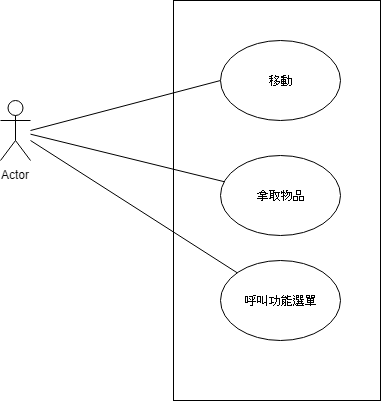
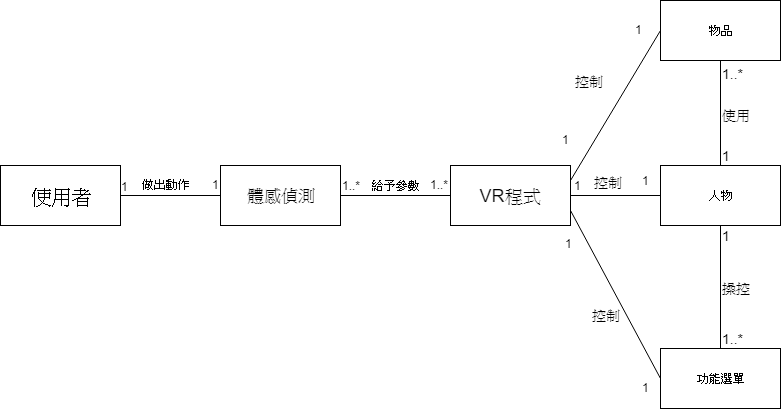

1. 以現有VR結合體感 
2. 能不靠手把就能控制 能支援許多VR程式 提高動作複雜度
3. 功能性需求:不依賴手把控制
   非功能性需求:支援其他程式 提升動作複雜度
4. 
5. 位移>拿取物品>叫出功能選單
6. 位移
   1. 使用者做出動作
   2. 體感感應使用者動作
   3. VR程式根據體感對人物模組做出相對應的位移
   
   拿取物品
   1. 使用者做出動作
   2. 體感感應使用者動作
   3. VR程式偵測到物體被觸碰
   4. 物體模組和人物模組合體
   5. VR程式根據體感做出功能
   
   叫出功能選單
   1. 使用者做出手掌由上往下滑
   2. 體感感應使用者做出特殊動作
   3. VR程式呼叫功能列表
   
7. 我是一個玩家，我希望不靠手把控制以便能讓我更精確操控角色。
8.

9.
