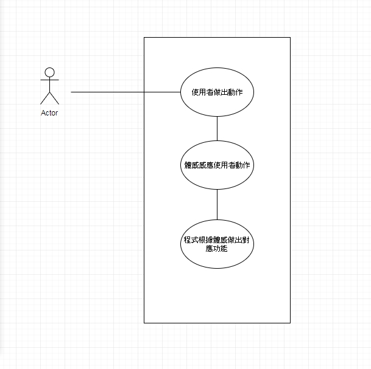

//1. 專題題目
//2. 文字敘述專題需求
//3. 寫出專題之功能性需求與非功能性需求
//4. 畫出 使用案例圖 (use case diagram)
//5. 由上而下 排出 使用案例的重要性
//6. 寫出 其中的 至少三個使用案例
//7. 寫出 user story 

1. 以現有VR結合體感 
2. 能不靠手把就能控制 能支援許多VR程式 提高動作複雜度
3. 功能性需求:不依賴手把控制
   非功能性需求:支援其他程式 提升動作複雜度
4. 5. 6.

7. 我是一個玩家，我希望不靠手把控制以便能讓我更精確操控角色。
