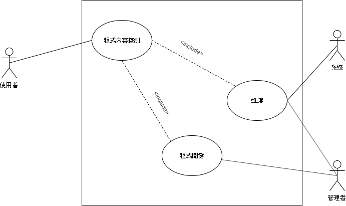
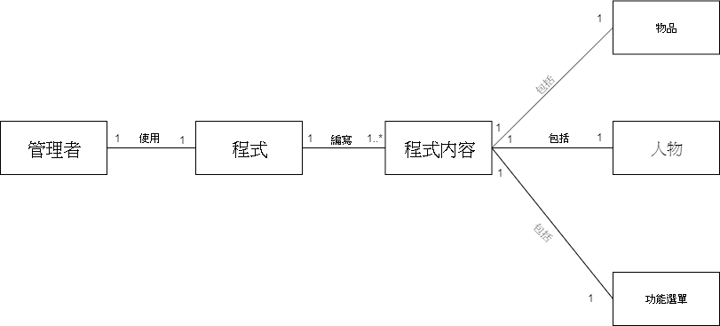
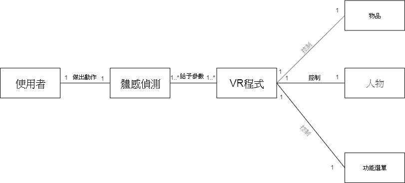
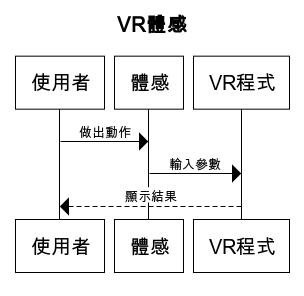
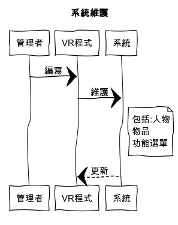
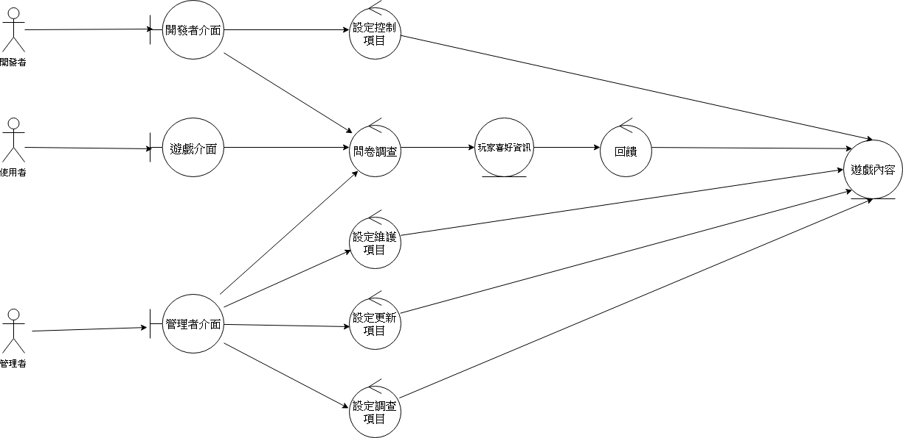

# 1. **專題題目**:以現有VR結合體感 
# 2. **文字敘述專題需求**:

         * 不用手把即能操控VR程式內的角色及物件，使使用者更輕鬆地使用程式。
         
         * 簡易且直觀的合併體感與VR的程式，使開發者輕易地開發相關的程式。
         
         * 環境感測系統，讓使用者避免掉因現實世界的物體而導致受傷的情況。
# 3. **功能性需求**:

        不依賴手把控制 環境感測系統

#    **非功能性需求**:

        支援其他程式 提升動作複雜度
        
# 4. **使用案例圖**

# 5. **由上而下 排出 使用案例的重要性**:

程式開發>維護>程式內容控制

# 6. **寫出 其中的 至少三個使用案例:**

   ## 程式開發
   1. 管理者設計架構、模組製作
   2. 程式碼撰寫
   3. 軟體整合，自動兼容體感與VR程式
   4. 封閉測試
   5. 發布
   
   
   ## 維護
   
   主要路徑
   1. 例行性檢查   
   2. 伺服器停止
   3. 程式碼、模組優化
   4. 伺服器重開
   
   替代路徑
   
   1.1 玩家回報系統漏洞
   
  ## 程式內容控制
   
        I.位移
        
                1. 使用者做出動作
                2. 體感感應使用者動作
                3. VR程式根據體感對人物模組做出相對應的位移
                
        II.拿取物品
        
                1. 使用者做出動作
                2. 體感感應使用者動作
                3. VR程式偵測到物體被觸碰
                4. 物體模組和人物模組合體
                5. VR程式根據體感做出功能
                
         III.功能選單
         
                1. 使用者做出手掌由上往下滑
                2. 體感感應使用者做出特殊動作
                3. VR程式呼叫功能列表
                
   
# 7. **user story** :

* 我是一個使用者，我希望不靠手把控制以便能讓我更精確操控角色。

* 我是一個管理者，我希望使用這個系統以便能更好開發、維護VR與體感相關的程式。
                   
* 我是一個系統，我希望能更有效率的運算以便能提供良好的使用體驗。

# 8.**初步類別圖:**

# 9.**系統循序圖:**

# 10.**強韌圖:**

# 系統強韌圖

