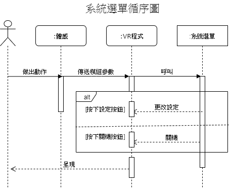
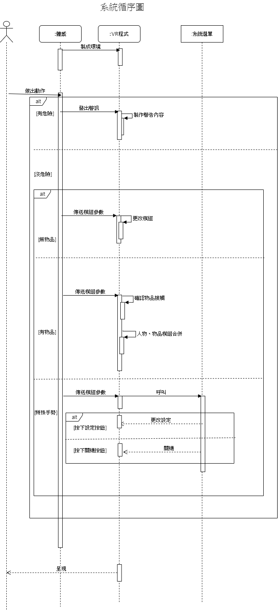

# 組員: 0624016吳宥霖 0624030盧友舜

# 1. **專題題目**:以現有VR結合體感 
# 2. **文字敘述專題需求**:

簡介

將VR程式結合體感，使得VR使用者有更好的體驗，並利用體感設計出環境感測，讓VR使用者在使用的過程中不用擔心因現實的物體而造成受傷的情形。

背景

近期VR、體感技術盛行，有不少別出新意的應用，我們希望透過此案例- 提升VR使用者體驗 為目的來實作，嘗試將VR體驗達到更新一步的境界。

         * 不用手把即能操控VR程式內的角色及物件，使使用者更輕鬆地使用程式。
         
         * 簡易且直觀的合併體感與VR的程式，使開發者輕易地開發相關的程式。
         
         * 環境感測系統，讓使用者避免掉因現實世界的物體而導致受傷的情況。
# 3. **功能性需求**:

        VR程式不依賴手把控制 
        環境感測系統 讓使用者更安全

#    **非功能性需求**:

        支援各種程式、模組 提升動作複雜度
        語法易學 上手容易
        
# 4. **使用案例圖**

# 5. **由上而下 排出 使用案例的重要性**:

環境感測>位移>功能選單>拿取物品

# 6. **寫出 其中的 至少三個使用案例:**

   ## 位移
        
   1. 使用者做出動作
   2. 體感感應使用者動作
   3. VR程式根據體感對人物模組做出相對應的位移
   
   
   ## 功能選單
         
   1. 使用者做出手掌由上往下滑
   2. 體感感應使用者做出特殊動作
   3. VR程式呼叫功能列表
   
  ## 環境感測
   
   1. 體感攝影機辨別使用者
   2. 體感攝影機掃描環境物品
   3. 使用者接近環境物品
   4. 體感傳出警訊至VR程式
   5. VR程式顯示介面體醒使用者
                
# 7. **user story** :

* 我是一個使用者，我希望不靠手把控制以便能讓我更精確操控角色。

* 我是一個管理者，我希望使用這個系統以便能更好維護VR與體感相關的程式。

# 8.**初步類別圖:**

### 位移初步類別圖

### 拿取物品初步類別圖

### 功能選單初步類別圖

### 環境感測初步類別圖

# 9.**循序圖:**

# 10.**強韌圖:**

# 11.**類別圖:**

